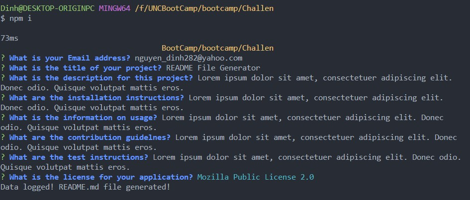
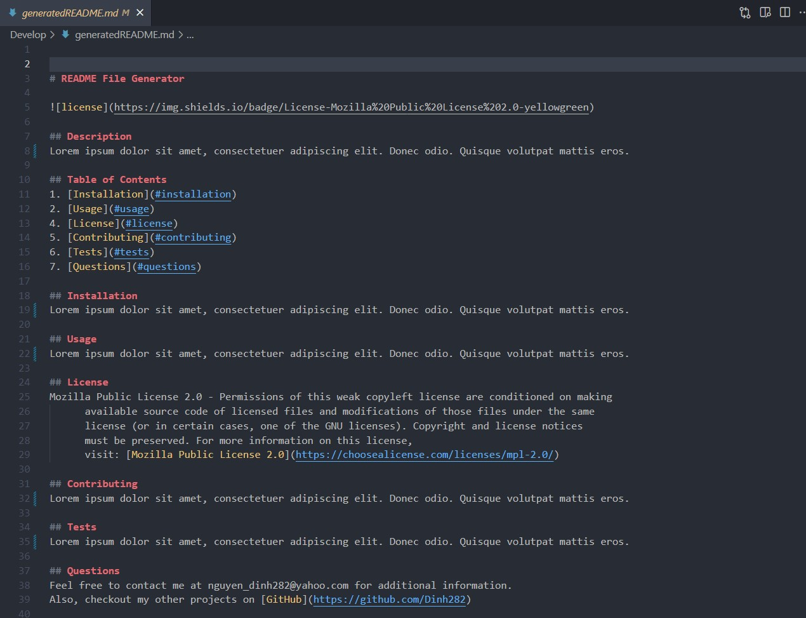
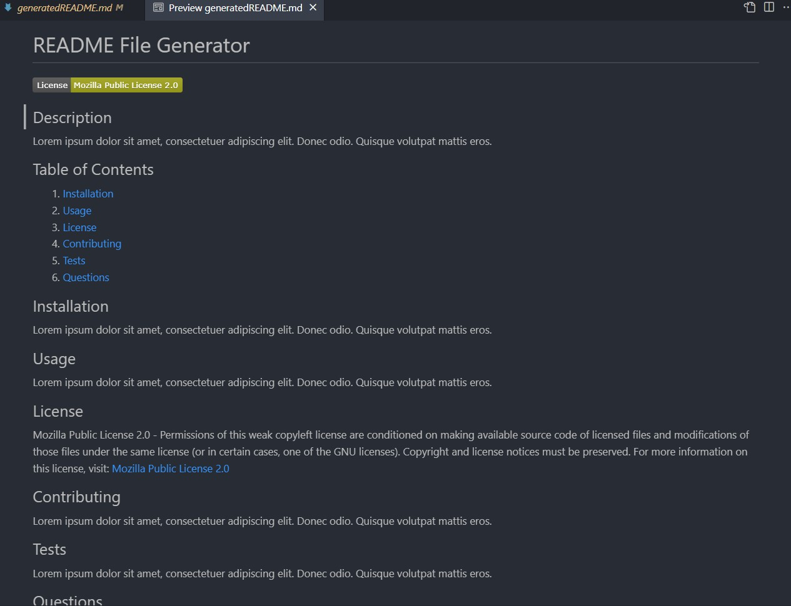

# Professional README Generator 

## Description

This application allows you to generate a professional README.md file through the command line. By doing this project, I was able to practice working with Javascript, Node.js, and NPM packages for Node.js such as Inquirer. Practicing with these technologies helped me better understand how server-side applications are built in Javascript. Node.js is a JS runtime environment that uses the V8 engine from Google to run JavaScript code outside of the browser; this would allow application developments to take place on the server side.

## Table of Contents (Optional)
1. [Installation](#installation)
2. [Usage](#usage)
3. [Credits](#contributing)
4. [Questions](#questions)  
5. [License](#license)

## Installation
- Download and install the Node.js LTS version from [Node.js](https://nodejs.org/en).
- Clone the repo using.
        
        git clone git@github.com:Dinh282/readme-generator.git

- Or download the code from https://github.com/Dinh282/readme-generator.git and open it with VS Code.
- Make sure you are on the path of the folder Develop of the project and then install dependencies for the project with:

        npm i

## Usage

- After installation, you can run the application with the following command:

        node index.js

- Command line prompts will ask you for information to be added to a README.md file.
- Type in your answers and hit enter to move through the prompts. 
- Once you have gone through all of the questions, you should see a file called generatedREADME.md file generated
in the Develop folder.
- If you run the application again, the new data will overwrite the generatedREADME.md.

Video Demo of Application:

https://github.com/Dinh282/readme-generator/assets/112836220/19d57322-a98d-48d1-b6c2-19e50134a134

 Screenshot of Command Line Prompts:

 Screenshot of Code For Generated README.md File:

 Screenshot of Preview Of Generated README.md File:

## Credits:

1. https://shields.io/category/license (Helped with creating license badges for generated README.md file)

2. https://www.npmjs.com/package/inquirer (Documentation for inquirer package)

3. https://blog.mergify.com/which-open-source-license-should-you-use-for-github-project/ (Provides some open source licenses)

4. https://www.apache.org/licenses/LICENSE-2.0 (information on Apache 2.0 License)

5. https://appmaster.io/blog/what-is-the-bsd-license (information on BSD license)

6. https://pitt.libguides.com/openlicensing/MIT (information on MIT license)

7. https://coding-boot-camp.github.io/full-stack/github/professional-readme-guide (Help with creating a professional README.md file)

8. https://choosealicense.com/licenses/ (Licenses)

9. https://www.educative.io/answers/how-to-use-the-inquirer-node-package (Help with understanding inquirer package)

10. https://medium.com/huawei-developers/how-to-add-an-embedded-video-on-github-readme-file-450f83be157a#:~:text=Conclusion,Drop%20feature%20provided%20by%20Github (Help with adding video to readme.md)

11. Instructor, TAs, and classmates.

## Questions
Feel free to contact me at nguyen_dinh282@yahoo.com for additional information.  
Also, check out my other projects on [GitHub](https://github.com/Dinh282)

## License

Please refer to the LICENSE section in the repository.

---

